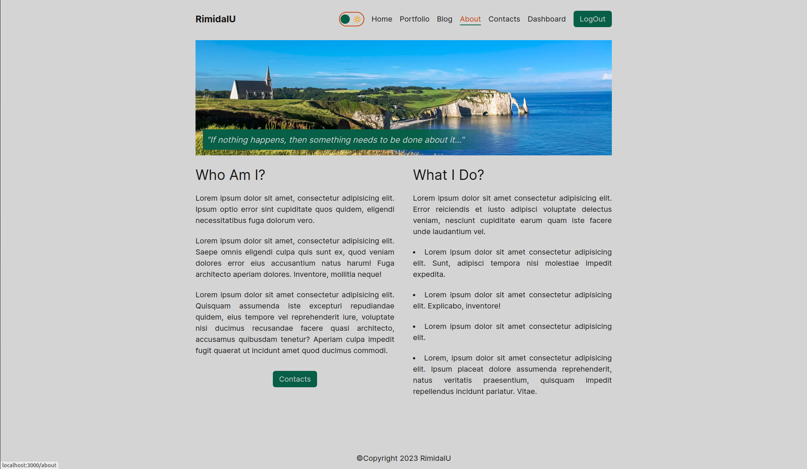
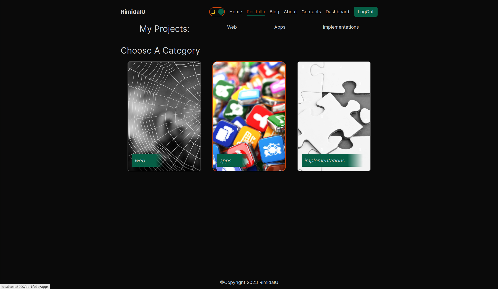

# My Next Portfolio.

> New version of my portfolio site.

---

[Description](#description) •
[Project setup](#project-setup) •
[Features](#features) •
[How To Use](#how-to-use) •
[Project Status](#project-status) •
[Room for Improvement](#room-for-improvement) •
[License](#license) •
[Contact](#contact)

## Description

Single page application in Next.js. 

In addition to describing some of my projects, there is a micro-blog that I hope I will keep (after all, any self-respecting developer creates a blog platform or at least a page with posts before writing his first post about his beloved cat or cactus 😉).

Stack: Next (SSR and CSR), TypeScript, TailwindCSS, MongoDB, Next's fetch() API... CredentialsProvider and GoogleProvider signing in.

## Project setup

- Clone this repo to your desktop and run `yarn` or `npm install` to install all the dependencies.
- Once the dependencies are installed, you can run `yarn dev` or `npm dev` to start the application.
- Enjoy.

## Features

- SPA in Next.js, TypeScript and TailwindCSS.
- Next's fetch() API for work with DB.
- CredentialsProvider and GoogleProvider signing in.
- CRUD posts in MongoDB.
- Next's SSR and CSR.

## How To Use

<!-- Run [Live Demo](https://react-rtk-table.netlify.app/) -->

![tutorial][tutorial]

## Project Status

Project is: _in progress_

## Room for Improvement

To do:

- [ ] Add content.
- [ ] Add message sender in contact form.
- [ ] Add pagination in posts.
- [ ] Add search in projects by tools.
- [ ] Add 3D graphics.
- [ ] Add i18next.

Improvement:

- [ ] Add Strapi or Sanity CMS.
- [ ] Add comments to posts
- [ ] Refactor posts CRUD to comments.

## License

This project is open source and available under the [MIT](../LICENSE).

## Contact

Created by [@RimidalU](https://www.linkedin.com/in/uladzimir-stankevich/) - feel free to contact me!

<!-- MARKDOWN LINKS & IMAGES -->

[tutorial]: ./assets/demo.webp
